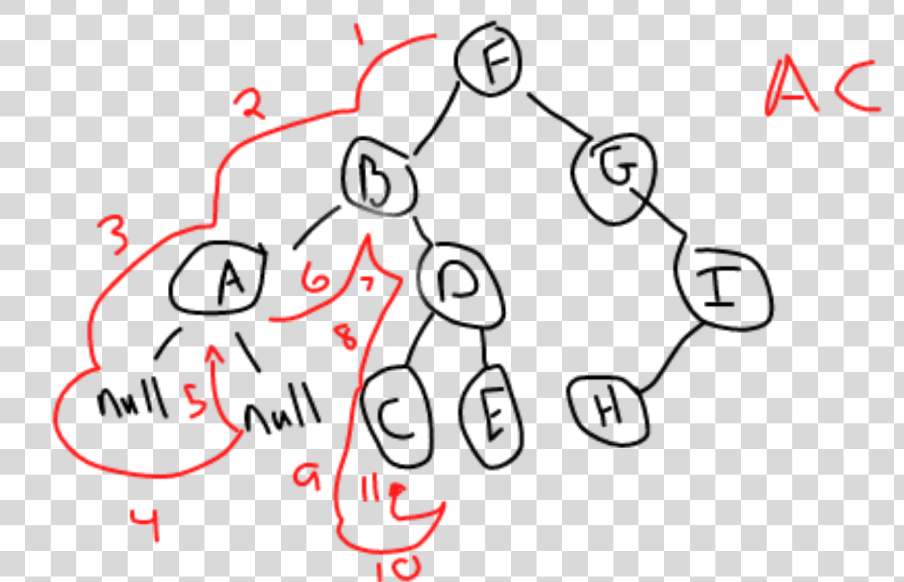

# Types of Algorithms 
## Depth-first (stack)

1. Pre-order
2. In-order
3. Post-order

## Breadth-first (Queue)

1. Level order 

# Tree Traversal

> A systematic way of visiting nodes in a tree

## Pre-order tree Traversal

1. Visit node
2. Traverse left
3. Traverse right

***Psuedocode***

preorder(node)
    if node === null then return
    visit(node)
    preorder(node.left)
    preorder(node.right)

***Time Complexity***

O(n)

> Where n is the number of nodes in the tree

## In-order tree traversal

1. Traverse left
2. Visit node
3. Traverse right

F -> B -> A -> No Left -> Return and Output A -> Check A Right -> Return and Output B

***Psuedocode***

inorder(node)
    if node == null then return
    inorder(node.left)
    visit(node)
    inorder(node right)

***Time Complexity***

O(n)

> Where n is the number of nodes

## Post-order tree traversal

1. Traverse left
2. Traverse right
3. Visit node

F -> B -> A -> null -> null -> Return and Output A -> Return to B -> D -> C -> null -> null -> Return and Output C

